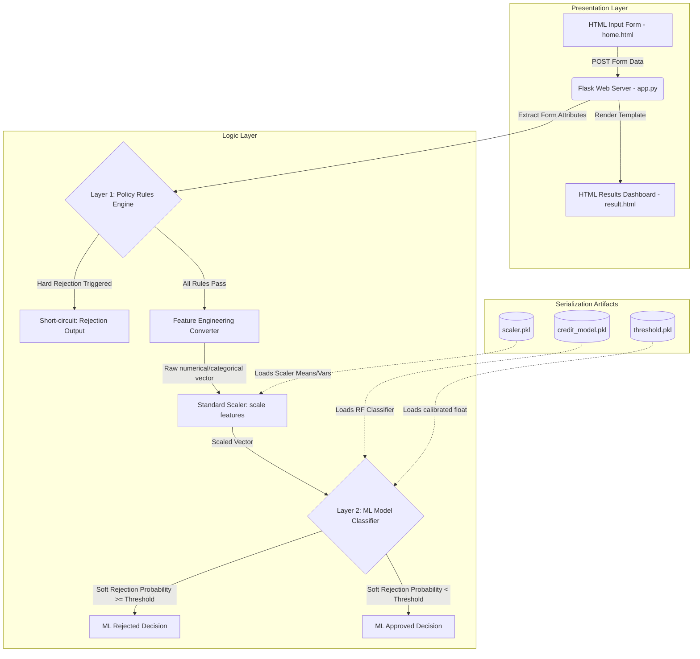
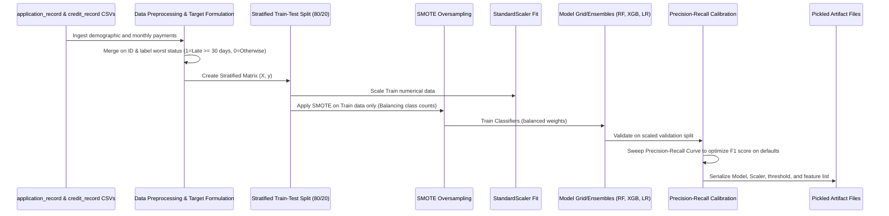

# Phase 3: Project Design Phase

This document outlines the architectural design, data workflow models, and API interfaces for the Credit Card Approval Prediction System.

---

## 1. Architectural Overview

The application follows a modular, decoupled architecture dividing the system into three primary layers: **Presentation (UI) Layer**, **Logic (Policy & Core Inference) Layer**, and **Data & Training Pipeline Layer**.

---

## 2. Component Layout & Responsibility

The system components are organized as follows:

1. **`app.py`**: Acts as the main application controller. It initializes the Flask server, exposes request-response routing endpoints, processes inputs, and implements the **Layer 1 Policy Override Rules**.
2. **`model.py`**: Executes the training workflow. It ingests CSV datasets, structures targets, runs preprocessing and SMOTE balance operations, fits the scaler, evaluates model architectures, and serializes the resulting artifacts.
3. **`static/css/style.css`**: The design system stylesheet. It establishes color constants (dark-theme background, emerald-green success borders, warning-red alerts), cards, and layouts.
4. **`templates/home.html`**: The UI entrypoint. Contains the client questionnaire input panel and houses static references for EDA charts.
5. **`templates/result.html`**: The outcomes display board. It renders risk percentages, status labels, policy logs, and comparison tables.

---

## 3. Data Pipeline & Training Flow

The ML training pipeline is designed to be fully reproducible:

---

## 4. API Endpoints Specification

### 4.1 Home Screen
* **Route**: `/`
* **Method**: `GET`
* **Response**: `200 OK` (renders `home.html`)
* **Usage**: Renders the credit underwriting dashboard with the multi-parameter input form.

### 4.2 Prediction Outcome
* **Route**: `/predict`
* **Method**: `POST`
* **Request Content-Type**: `application/x-www-form-urlencoded`
* **Parameters (Form Fields)**:

| Field Name | Type | Value Range / Description |
| :--- | :--- | :--- |
| `gender` | `int` | `0` = Female, `1` = Male |
| `own_car` | `int` | `0` = No, `1` = Yes |
| `own_realty` | `int` | `0` = No, `1` = Yes |
| `income_type` | `int` | `0` = Working, `1` = Associate, `2` = Pensioner, `3` = State, `4` = Student |
| `education` | `int` | `0` = Higher, `1` = Secondary, `2` = Incomplete, `3` = Lower, `4` = Academic |
| `family_status`| `int` | `0` = Civil, `1` = Married, `2` = Single, `3` = Separated, `4` = Widow |
| `housing_type` | `int` | `0` = Rented, `1` = House, `2` = Municipal, `3` = Parents, `4` = Co-op, `5` = Office |
| `occupation` | `int` | `0` to `18` (Mapped as per occ_map in model.py) |
| `annual_income`| `float` | Annual salary input in USD (e.g. `45000.00`) |
| `age` | `int` | Age in years (e.g. `34`) |
| `employment_days`| `float`| Employment duration in years (e.g. `4.5` or `0.0`) |
| `family_members`| `int` | Total family size (e.g. `3`) |

* **Response**: `200 OK` (renders `result.html`)
* **Returned Template Variables**:
  * `result`: `'APPROVED'` or `'REJECTED'`
  * `color`: `'green'` or `'red'`
  * `details`: Dictionary representing echo parameters, probabilities (`prob_approved` and `prob_rejected`), and policy status flags (`policy_reject` and `policy_reason`).
